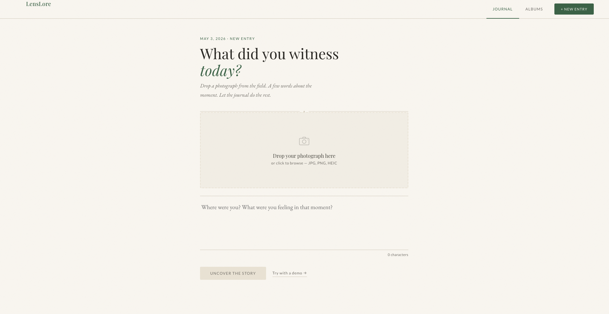
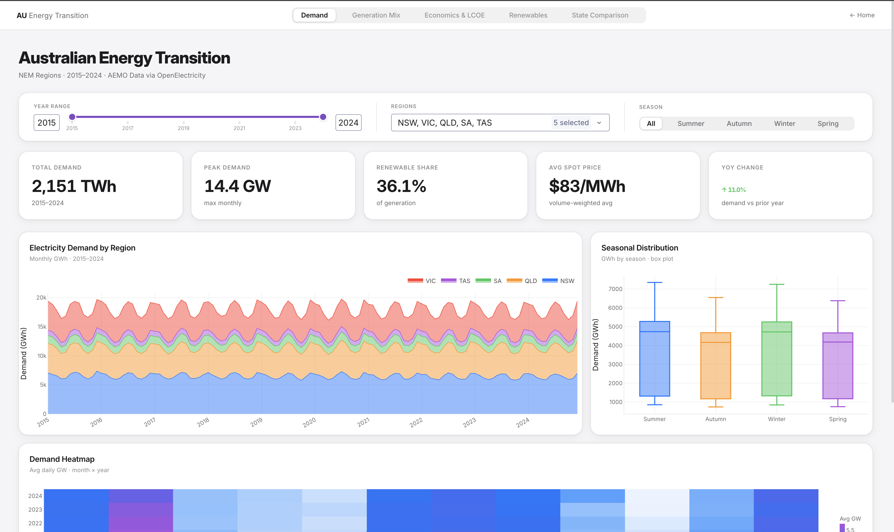
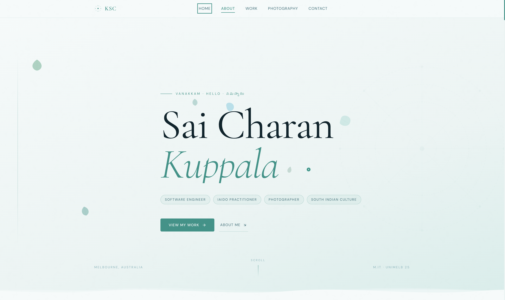
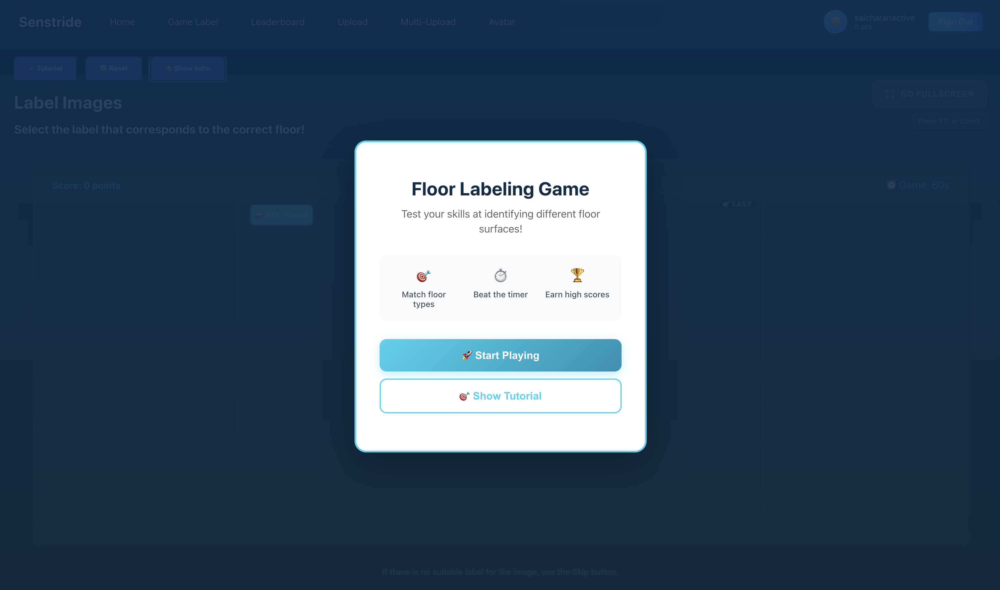

&nbsp;

Full-stack engineer with 4+ years shipping production software across mobile and web. Co-founding [SiteSpace](https://sitespace.com.au) while completing a Masters at the University of Melbourne.

 

**What I work on**

- Full-stack product builds from system architecture to app store submission
- AI-assisted tooling and agentic workflows with LLMs
- Performance profiling and building apps that feel fast with minimal memory footprint
- Turning messy real-world problems into clean, deliberate software

**Work**

<table>
<tr>
<td align="center" width="50%">

  
<strong>SiteSpace Web</strong>

Co-founded and built the SiteSpace web platform, a construction-focused asset management tool that helps teams track, organise, and maintain equipment and resources in one place, improving visibility and operational efficiency on site.

</td>
<td align="center" width="50%">

  
<strong>SiteSpace Mobile</strong>

Co-founded and built the SiteSpace mobile app, a responsive application for construction asset booking that helps businesses engage users, scale effectively, and manage on-site operations from any device.

</td>
</tr>
<tr>
<td align="center" width="50%">

  
<strong>EarlySpot</strong>

Built an AI-powered melanoma detection platform that analyses skin lesion images to enable fast, non-invasive early diagnosis, empowering healthcare professionals with accurate insights when treatment is most effective.

</td>
<td align="center" width="50%">

  
<strong>Focus Bear</strong>

Built accessibility-first mobile features for Focus Bear, a neurodiversity-informed productivity app helping people with ADHD and ASD improve focus, build habits, manage routines, block distractions, and stay in sync across devices.

</td>
</tr>
<tr>
<td align="center" width="50%">

  
<strong>The Children's Place</strong>

Contributed to The Children's Place mobile app, an e-commerce platform for iOS and Android that enables families to browse and shop children's products with secure checkout, real-time inventory, personalised experiences, and order tracking.

</td>
<td align="center" width="50%">

  
<strong>Sunbelt Rentals</strong>

Contributed to the Sunbelt Rentals mobile app, an enterprise-grade solution that lets contractors browse, rent, track, and return equipment in real time, with seamless booking, payments, job-site management, and a mobile-first user experience.

</td>
</tr>
</table>

**Fun Projects**

<table>
<tr>
<td align="center" width="50%">

  
<strong>LensLore AI</strong>

Built LensLore AI, a storytelling platform for nature photographers that turns uploaded photos and reflections into cinematic, full-page narratives with colour-aware ambience.

<strong>Stack:</strong> Aurelia 2 · Symfony 6 · AWS Lambda (TypeScript) · Claude Sonnet 4 · PostgreSQL (RDS) · Amazon S3 · CloudFront

</td>
<td align="center" width="50%">

  
<strong>Dash EV</strong>

Built Dash EV, a dual-product analytics platform for EV market intelligence and Australian energy transition modelling with interactive dashboards and production-ready data services.

<strong>Stack:</strong> FastAPI · Uvicorn · Dash 2.17 · Plotly · pandas · pyarrow · Flask-Caching · OpenElectricity · pytest · FastAPI TestClient · Flask test client

</td>
</tr>
<tr>
<td align="center" width="50%">

  
<strong>Personal Site</strong>

Built a personal portfolio site to showcase projects, writing, and engineering focus areas through a clean, fast, and responsive experience focused on clarity and storytelling.

<strong>Stack:</strong> Stack details to be synced from project README.

</td>
<td align="center" width="50%">

  
<strong>Fruit Ninja Image Label</strong>

Built a computer-vision labeling project inspired by Fruit Ninja gameplay to classify and tag fruit images for model-training workflows and annotation-driven experimentation. This implementation also powered components for the Senstride client project (<a href="http://main.d1ddvpozee4rfm.amplifyapp.com">live demo</a>).

<strong>Stack:</strong> Stack details to be synced from project README.

</td>
</tr>
</table>

**Tech**

`JavaScript` `TypeScript` `Python` `Java` `Kotlin` `Swift` `C#` `GoLang` `SQL` `Bash`

`React Native` `React` `Next.js` `Redux-Saga` `FastAPI` `Node.js` `.NET` `Spring Boot` `Laravel`

`AWS` `Azure` `GCP` `Docker` `Terraform` `PostgreSQL` `MongoDB` `Redis` `PostGIS`

`Git` `Sentry` `PostHog` `Charles Proxy` `Figma` `Cursor` `Claude Code`

Crafted with intention &nbsp;·&nbsp; Melbourne, AU

