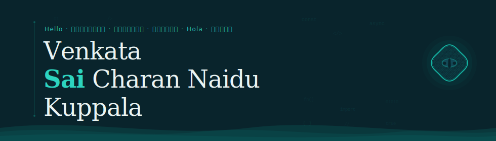

&nbsp;

I build things with care — software that feels intuitive, photographs that hold a moment, and movements in Iaido that embody *zanshin*.

A software engineer with 4+ years of professional experience across mobile and web. Born in Andhra Pradesh, now based in Melbourne. Rooted in South Indian culture — its art, music, and philosophy guide how I approach both code and life.

 

**What I work on**

- Full-stack product builds — from system architecture to app store submission
- AI-assisted tooling and agentic workflows with LLMs
- Performance profiling — apps that feel fast and consume minimal memory
- Turning messy real-world problems into clean, deliberate software

**Tech**

`JavaScript` `TypeScript` `Python` `Java` `Kotlin` `Swift` `C#` `GoLang` `SQL` `Bash`

`React Native` `React` `Next.js` `Redux-Saga` `FastAPI` `Node.js` `.NET` `Spring Boot` `Laravel`

`AWS` `Azure` `GCP` `Docker` `Terraform` `PostgreSQL` `MongoDB` `Redis` `PostGIS`

`Git` `Sentry` `PostHog` `Charles Proxy` `Figma` `Cursor` `Claude Code`

**Projects**

[**Dash-EV**](https://github.com/SaiCharan99/Dash-EV) &nbsp;·&nbsp; Dual-product data analytics platform — EV market intelligence & Australian energy transition &nbsp;·&nbsp; FastAPI · Dash · Plotly

[**SiteSpace**](https://sitespace.com.au) &nbsp;·&nbsp; AI-powered construction asset booking platform &nbsp;·&nbsp; *Co-Founder*

[**EarlySpot**](https://earlydemospot.link/dashboard) &nbsp;·&nbsp; Melanoma detection — deep learning model to production app

[**Senstride**](http://main.d1ddvpozee4rfm.amplifyapp.com) &nbsp;·&nbsp; Gamified ML data labelling on serverless AWS

Crafted with intention &nbsp;·&nbsp; Melbourne, AU

