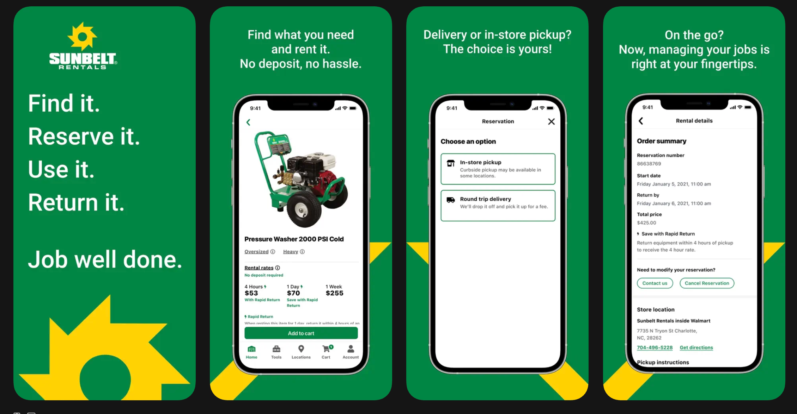
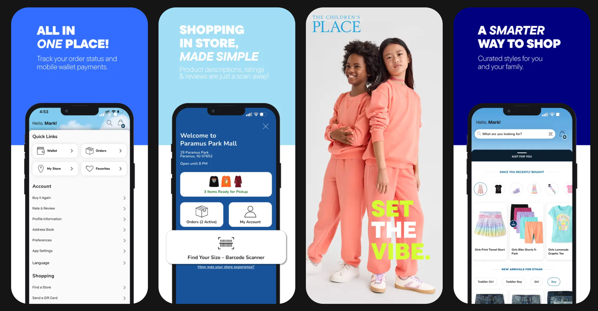
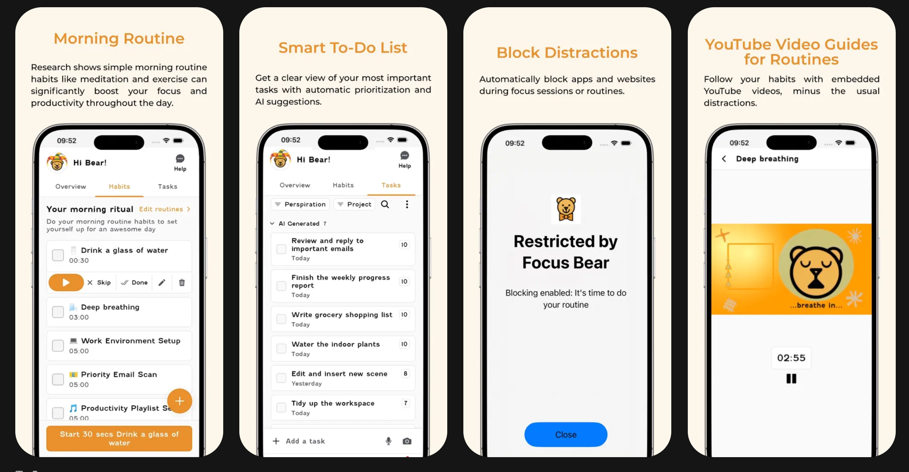
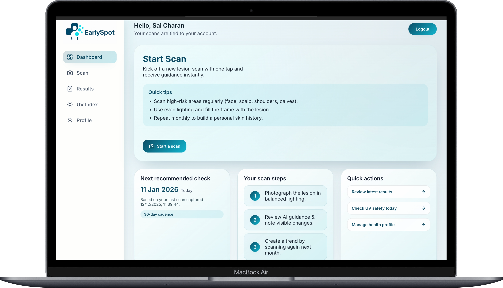
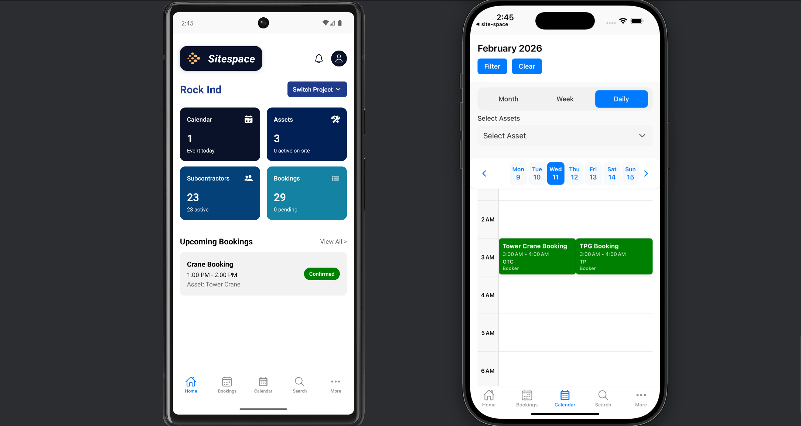
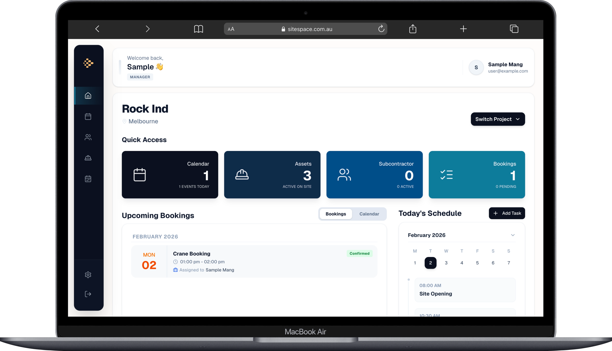

&nbsp;

Full-stack engineer with 4+ years shipping production software across mobile and web. Co-founding [SiteSpace](https://sitespace.com.au) while completing a Masters at the University of Melbourne.

 

**What I work on**

- Full-stack product builds — from system architecture to app store submission
- AI-assisted tooling and agentic workflows with LLMs
- Performance profiling — apps that feel fast and consume minimal memory
- Turning messy real-world problems into clean, deliberate software

**Previous Work**

<table>
<tr>
<td width="55%"></td>
<td valign="top" width="45%">
 
<strong>Sunbelt Rentals</strong>  
Contributed to the Sunbelt Rentals mobile app — an enterprise-grade solution that lets contractors browse, rent, track, and return equipment in real time, with seamless booking, payments, job-site management, and a mobile-first user experience.
</td>
</tr>
<tr><td colspan="2"> </td></tr>
<tr>
<td width="55%"></td>
<td valign="top" width="45%">
 
<strong>The Children's Place</strong>  
Contributed to The Children's Place mobile app — an e-commerce platform for iOS and Android that enables families to browse and shop children's products with secure checkout, real-time inventory, personalised experiences, and order tracking.
</td>
</tr>
<tr><td colspan="2"> </td></tr>
<tr>
<td width="55%"></td>
<td valign="top" width="45%">
 
<strong>Focus Bear</strong>  
Built accessibility-first mobile features for Focus Bear — a neurodiversity-informed productivity app helping people with ADHD and ASD improve focus, build habits, manage routines, block distractions, and stay in sync across devices.
</td>
</tr>
<tr><td colspan="2"> </td></tr>
<tr>
<td width="55%"></td>
<td valign="top" width="45%">
 
<strong>EarlySpot</strong>  
Built an AI-powered melanoma detection platform that analyses skin lesion images to enable fast, non-invasive early diagnosis — empowering healthcare professionals with accurate insights when treatment is most effective.
</td>
</tr>
<tr><td colspan="2"> </td></tr>
<tr>
<td width="55%"></td>
<td valign="top" width="45%">
 
<strong>SiteSpace Mobile</strong>  
Co-founded and built the SiteSpace mobile app — a responsive, user-friendly application for construction asset booking, helping businesses engage users, scale effectively, and manage on-site operations.
</td>
</tr>
<tr><td colspan="2"> </td></tr>
<tr>
<td width="55%"></td>
<td valign="top" width="45%">
 
<strong>SiteSpace Web</strong>  
Co-founded and built the SiteSpace web platform — a construction-focused asset management tool that helps teams track, organise, and maintain equipment and resources in one place, improving visibility and operational efficiency.
</td>
</tr>
</table>

**Tech**

`JavaScript` `TypeScript` `Python` `Java` `Kotlin` `Swift` `C#` `GoLang` `SQL` `Bash`

`React Native` `React` `Next.js` `Redux-Saga` `FastAPI` `Node.js` `.NET` `Spring Boot` `Laravel`

`AWS` `Azure` `GCP` `Docker` `Terraform` `PostgreSQL` `MongoDB` `Redis` `PostGIS`

`Git` `Sentry` `PostHog` `Charles Proxy` `Figma` `Cursor` `Claude Code`

**Projects**

[**Dash-EV**](https://github.com/SaiCharan99/Dash-EV) &nbsp;·&nbsp; Dual-product data analytics platform — EV market intelligence & Australian energy transition &nbsp;·&nbsp; FastAPI · Dash · Plotly

[**SiteSpace**](https://sitespace.com.au) &nbsp;·&nbsp; AI-powered construction asset booking platform &nbsp;·&nbsp; *Co-Founder*

[**EarlySpot**](https://earlydemospot.link/dashboard) &nbsp;·&nbsp; Melanoma detection — deep learning model to production app

[**Senstride**](http://main.d1ddvpozee4rfm.amplifyapp.com) &nbsp;·&nbsp; Gamified ML data labelling on serverless AWS

Crafted with intention &nbsp;·&nbsp; Melbourne, AU

